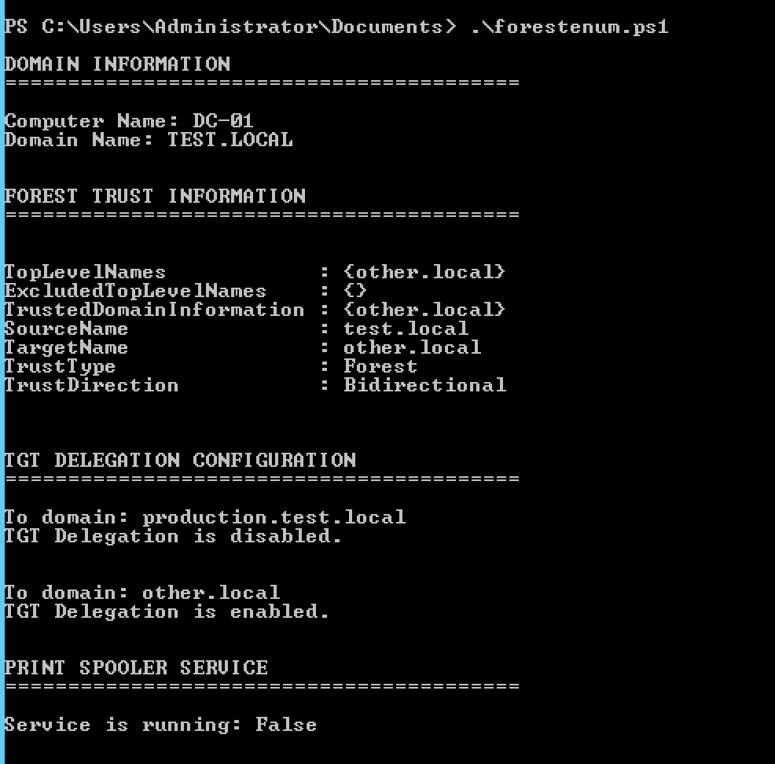

# ForestEnum
A small script to enumerate server configurations to prevent a forest trust attack as detailed by harmj0y (https://www.harmj0y.net/blog/redteaming/not-a-security-boundary-breaking-forest-trusts/).

*Disclaimer: This script has not been extensively tested.

## How to use?
1.Import Recon module from Powersploit (https://github.com/PowerShellMafia/PowerSploit/tree/master/Recon)

    Import-Module .\Recon.psm1
  
2.Run the forestenum script

    .\forestenum.ps1

## Output
The following is what the script outputs:

1.Trust relationships the forest has

2.TGT delegation configuration with other forests and child domains

3.Whether the print spooler service is running

